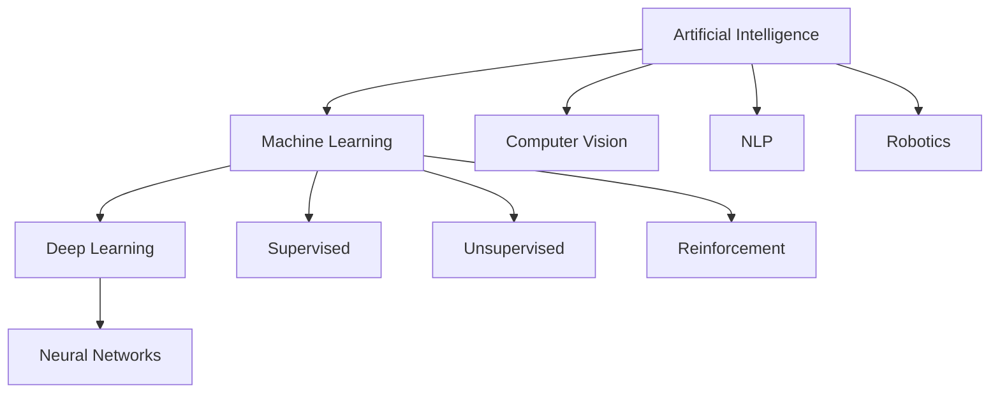

> - AI =the big goal
> - ML=one way to achieve AI
> - DL =a subset of ML




---

## Machine Learning
ML is a subset of AI where computers learn from data rather than following manually programmed rules

### Traditional Programming vs ML

| Traditional Programming | Machine Learning                  |
| ----------------------- | --------------------------------- |
| Data + Rules → Output   | Data + Learning Algorithm → Model |
| Rules written manually  | Patterns learned automatically    |
| Static                  | Improves with more data           |

#### Characteristics
- Learns from data 
- Makes predictions 
- Uses math and statistics to find the best solution.
- Classical ML often requires manual feature engineering
### Applications
- Spam Detection
- House Price Prediction
- Recommendation Systems

## Learning Paradigms

### => Supervised Learning

> Learns from **labeled data**
>  every example has a known correct answer "label"
    Goal:
    Predict outputs for unseen inputs

**Characteristics:**
- Requires labels.
- Teacher-student paradigm.
- Splits into two types:
    - **Classification** → predicting a category ( cat vs dog)
    - **Regression** → predicting a number ( house price)
    

### => Unsupervised Learning

> Learns from unlabeled data no ready-made answers.
    Goal: Discover hidden structures and patterns in the data
   
**Characteristics:**
- No labels.
- Clustering.
- Pattern discovery.
**Examples:**
- Customer Segmentation

### -> Reinforcement Learning

> An (Agent) learns through interaction with an Environment

**Core idea:**
```
Agent -> Action -> Reward/Penalty -> Learn -> Better Action
```
**Characteristics:**
- Trial and error.
- Sequential decision making
- Maximizes cumulative reward

**Examples:**
- Robotics
- Self-driving cars

## -> Deep Learning (DL)
DL is a specialized subset of ML based on ANN
### Characteristics
- Learns step by step: simple patterns → complex ones
- Finds important features on its own (no manual work)
- Great with images, text, audio, video
- Needs lots of data + strong hardware
- Black Box: accurate, but hard to explain why

### Training Process
1. **Forward Propagation** – data flows from input to output to produce a prediction.
2. **Back Propagation** – calculates the error and sends it backward to adjust the weights.
3. **Weight Updates** – weights get updated so the model becomes more accurate next time.

 > **Back Propagation:** If the prediction is wrong, the model goes back, figures out where the error came from, updates the weights, and tries to do better next time
 
### Variable Encoding
ML models need numerical inputs -> so categorical/text data must be converted into numbers so :
#### One-Hot Encoding
"hot with 1"
- One separate binary column per category.
- Used for nominal variables (no inherent order).
- Ex: Color{Red, Blue, Green} → 3 separate columns each 0 or 1

#### Dummy Encoding
- Similar to One-Hot Encoding
- Drops one redundant column since it's already understood from the other columns

#### Ordinal Encoding?
- Preserves the  logical order between categories.
- Example:
    - Small → 0
    - Medium → 1
    - Large → 2
----

      special case?
      Binary Encoding
            - Used when there are only two categories.


### Data Splitting

Purpose:
Split the dataset into different sets to evaluate the model fairly.

- Training Set (70%)
- Validation Set (10%)
- Test Set (20%)
> For Time Series, always split chronologically instead of randomly

---
  
#### What is Data Leakage In ML?
->The model accidentally sees information it shouldn't have

- The best prevention is to build your pipeline in the correct order:
    1. Split the data.
    2. Fit preprocessing on the training set only
    3. Apply the same transformations to the validation and test sets.
    4. Train and evaluate the model

Data Leakage vs Overfitting
> Data Leakage happens when the model (**cheats**) by seeing information it shouldn't have
> 
> Overfitting happens when the model (**memorizes**) the training data instead of learning patterns that generalize to new data